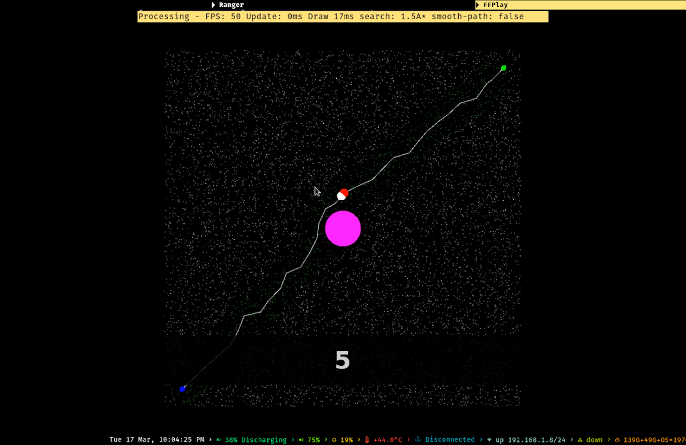

# motion-planning-algorithms

## description
- Simple motion planning algorithms for single agent, crowd and flocks in known/unknown environments.
- The task for an agent is to reach its goal without colliding with obstacles or other agents.
## code
- Code is written in Java, should work with JRE 8+.
    - `src/` contains all source code.
    - `jars/` contain all libraries bundled as jars.
        - `processing` is used as a rendering library.
        - `queasy cam` is used as a camera library.
    - `data/` contains resources such as images, obj, mtl files.
## documentation
- For most of the code, the documentation is itself.
## usage
- Open a terminal at project root (the directory containing this file).
- Use `javac -cp "jars/*" -d build/ $(find -name "*.java")` to compile and put all output class files under `build/`.
- Use `java -cp "build/:jars/*" <package>.<to>.<path>.<class>` to run any simulation.
    - For example `java -cp "build/:jars/*" demos.WalkCycle`.
- Common controls
    - `w a s d` for basic camera movements.
    - `q e` for camera up and down movements.
    - `p` for pause/play.
- Tested on Ubuntu 18.04
    - If you use a distrubution that uses rolling release cycle (like Arch) you might have to install some older version of JRE and mesa (opensource intel openGL driver) that work with processing library.
## demonstration
The following color scheme is used in all videos.
| Syntax      | Description |
| ----------- | ----------- |
| white sphere/line | agent |
| red sphere/line | agent in the future (useful to visualize how the path is smoothed) |
| green cube | goal |
| pink circle | obstacle |
| white point | sampled milestone |
| pink point  | milestone inside obstacle |
| green point | milestone on the fringe during search |
| red point | explored milestone during search |

The title bar shows the state of the system at any instant (current search algorithm, path smoothing on/off ...).
Most of the demos use path smoothing.

### Search methods on PRM and path smoothing
#### videos

A circular agent is in a square room.
Its goal is to reach the other diagonal.
But there is an obstacle in the middle of the room.

#### images
| Algorithm | Image
| --- | ---
| DFS | 
| BFS | 
| UCS | 
| A\* | 
| weighted A\* (1.5) |  |

### `PRM/A*` vs `RRT` vs `RRT*`
#### videos
| PRM/A\* | RRT | RRT\* |
| ----------- | ----------- | ----------- |
|  |  | 
|  |  | 
|  |  | 
| Graph | Growing tree | Growing and mutating tree
| Takes more memory | Takes less memory | Takes less memory
| Build time depends on environment | Build time depends on environment | Build time depends on environment
| Probabilistically complete (Finds a path at limit) | Probabilistically complete (Finds a path at limit) | Probabilistically complete (Finds a path at limit)
| Asymptotically optimal (Finds optimal path at limit) | Asymptotically NON optimal (Maynot optimal path at limit) | Asymptotically optimal (Finds optimal path at limit)

- In `RRT` and `RRT*` the tree is grown interactively.
- In `RRT` note that even when tree grows considerably the path to finish does not change and more importantly is not a shortest one.
- In `RRT\*` note that as tree grows the path to finish decreases until it reaches a shortest path at limit.

### Crowds using `time-to-collision` method
#### videos
- Simple case.

- Interactive placement.

- Antipodes.

- Traffic circle.

- Bottleneck.

- Crosspaths.

- Hallway.

- 2D swarms.

- 3D swarms.

### Crowds using `boids` method
#### videos
- Two flocks.

### `boids` vs `time-to-collision`
#### videos
| time-to-collision | boids |
| ----------- | ----------- |
|  |  |
|  |  |

### Failing/Odd cases
#### videos

- Too narrow passages.

- Takes a lot of time at the junction for the traffic to clear due to high symmetry.

- Some agents are beings captured by other flock.

### Misc
#### videos
- 3D context.

- Walkcycle.

- Bounding sphere heirarchy.

- Bounding sphere heirarchy is used as a spatial data structure to cull the edges of PRM that intersect obstacles.
- The title bar shows the current state (data structure used, time taken to cull edges, #obstacles).
- `b` - reset using bsh data structure.
- `v` - reset using vanilla data structure.
- ~10k obstacles almost uniformly spaced.
- Obstacles visualized @ `00:23`.
- Free edges visualizes @ `00:30`.
- BSH edge culling @ `00:46 - 00:56`, done several times.
- Vanilla edge culling @ `00:58 - 01:10`, done barely once, screen is unresponsive in that time.
- Bounding spheres visualized @ `01:35`.
- BSH edge culling time ~ 1000ms.
- Vanilla edge culling time ~ 12900ms.
- 12.9x faster.
- Speedup increases with setup size.

### Graph search time comparision

- The graph shows the average run time of the algorithms for searching the path in milliseconds.
- Each algorithm was run in simulations with 196 agents and the average time of searching the path for all the agents is calculated.
- There is a sharp decrease in search time with A\* and weighted A\*.
- Most of the demos use A\* search.

### 2D Rotation
- The agent is a directed linesegment with direction visualized by two boxes at center and one end.
- The agent makes 180 degree turn in its journey from start to finish.
- The paths in 3D configuration space and its mapping in 2D as position and orientation is visualized.
- The milestones inside obstacles in 3D configutation space are colored pink.
- Path smoothing is done using a bounding sphere for the agent and is demonstrated.
- The title bar shows whether or not smooth pathing is done and which search is used.
#### videos

### Exploring (a static) world on the way
- The robot does not know where the obstacles are.
- It has a sensor which tells the positions of obstacles in a fixed sphere around the it.
- Therfore it doesnot know what exists beyond that sensing sphere.
- It need to reach the goal on top right.
- The yellow points represent sensed region.
- The agent always stays inside sensed region.
- The milestones found to be inside obstacles are colored pink.
- Green and red points are related to search as before.
- Note that in videos the obstacles are sometimes hidden to visualize what the world looks like for the agent.
- Path smoothing is done only inside the sensed region is demonstrated.
- The title bar shows whether or not smooth pathing is done and which search is used.
#### the essensce of D\* lite
- Sense
- Plan to go to finish using milestones as if there are no other obstacles other than what is found
- Move along that path (until the edge of sensed area)
- If finish reached stop, else go to step 1
#### videos
- Wall
- Path smoothing @ `00:23`.

- Big ball

- Unreachable

- Zig zag

